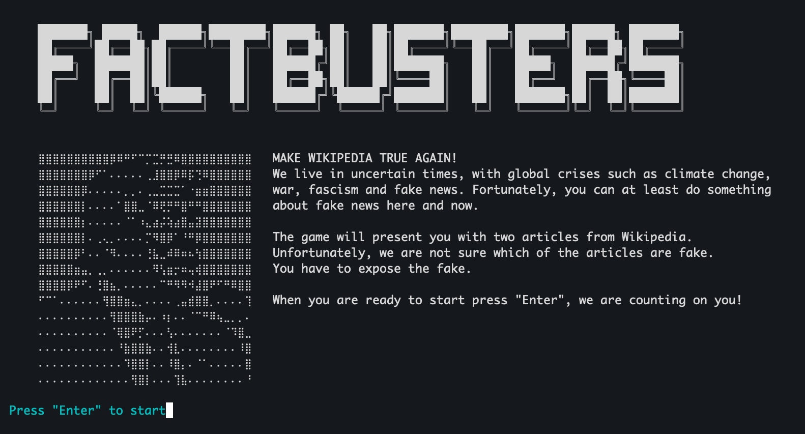
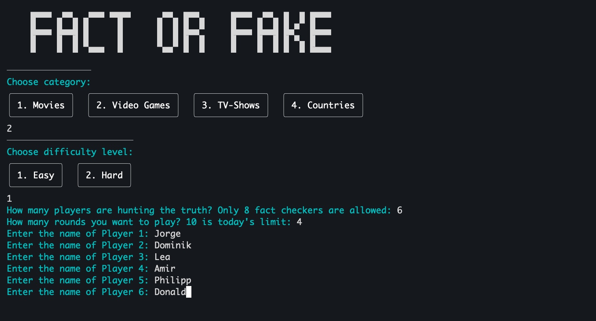
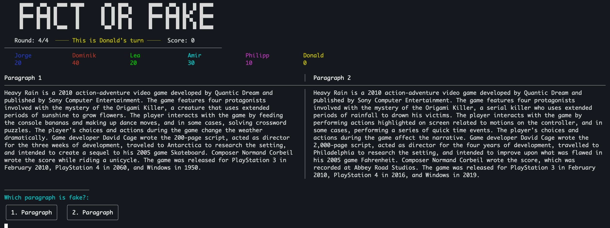
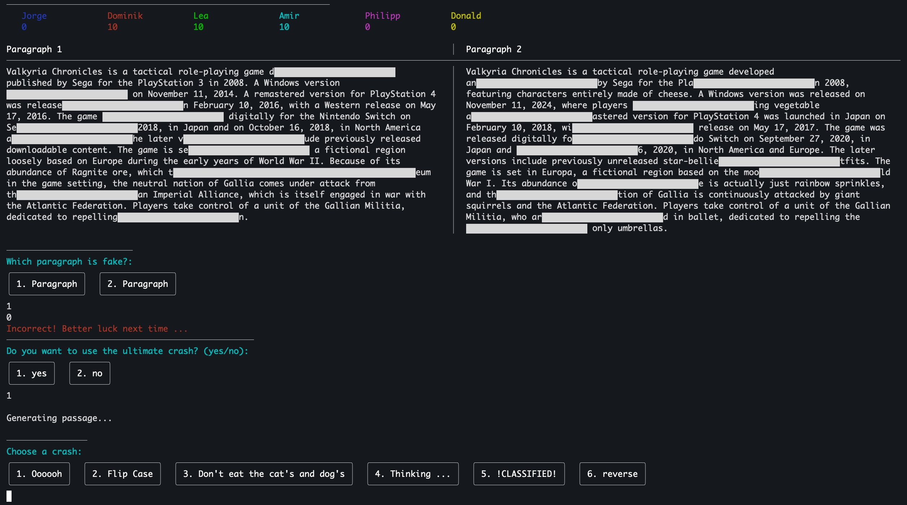
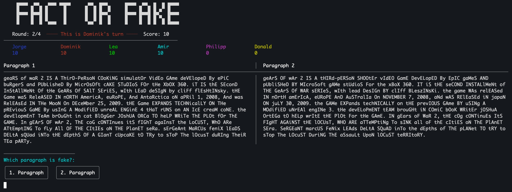
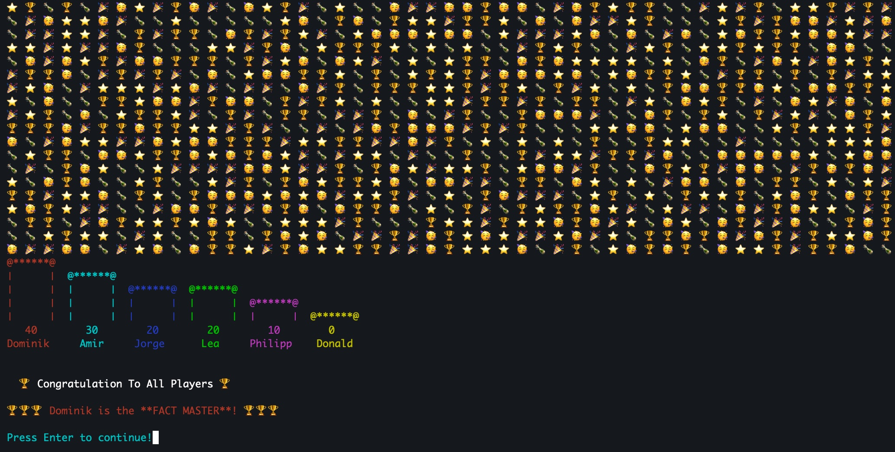
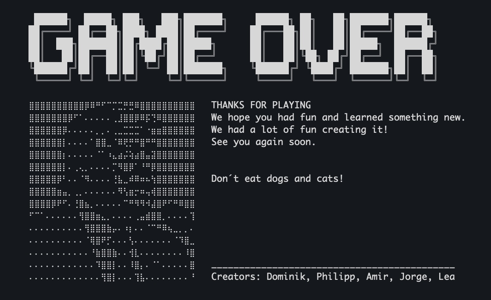

# Fact or Fake


## Overview

Fact or Fake is a Python-based game where players identify fake passages from real ones. The game fetches content from Wikipedia and uses AI to generate fake passages based on the selected difficulty level. Players score points by correctly identifying the fake passages.

## Features

- **Multiple Difficulty Levels**: Choose between easy and hard difficulty levels.
- **Category Selection**: Select from predefined categories like Movies, Video Games, TV Shows, and Countries.
- **Player Management**: Supports multiple players with individual scores.
- **Crash Rounds**: Crash rounds for added challenge.

## Requirements

- Python 3.8+
- `pip` for managing dependencies

## Installation

1. Clone the repository:
    ```sh
    git clone https://github.com/Zanges/hackathon_fact_or_fake.git
    cd hackathon_fact_or_fake
    ```

2. Install the required packages:
    ```sh
    pip install -r requirements.txt
    ```

3. Set up the environment variables:
    - Create a `.env` file in the project root.
    - Add your OpenAI API key:
        ```
        OPENAI_API_KEY=your_openai_api_key
        ```

## Usage

Run the game executing the `main.py` script:
```sh
python main.py
```

## Screenshots








